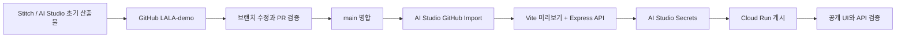

# LALA-demo AI Studio -> Cloud Run 실습 가이드

이 문서는 2026-08-27에 `geondongkim/LALA-demo`를 Google AI Studio로
가져와 빌드하고, 서버 Secret을 연결하고, Cloud Run 기반 공개 앱으로
게시한 실제 절차를 기록한다.

## 1. 완료 상태

- GitHub: <https://github.com/geondongkim/LALA-demo>
- AI Studio 앱: <https://aistudio.google.com/apps/44f1eca9-b48f-4abf-8808-c31168def63f?showAssistant=true&showPreview=true>
- 공개 앱: <https://lala-local-trip-20260827.ai.studio>
- 가져온 GitHub 기준 커밋: `799d20b081db315724abc0a970f3e7e8b2882673`
- AI Studio 빌드: 성공
- 공개 앱 상태: Ready
- 공개 `/api/health`: HTTP 200, Gemini 서버 설정 확인
- 서버 Gemini 도슨트: 실제 공개 앱에서 성공 확인

이 앱은 디자인·상호작용 검증용 데모다. 장소, 지도, 날씨, 신선도,
Local Signals는 번들된 데모 데이터이며 LALA 운영 데이터가 아니다.

## 2. 구조



브라우저는 `/api/health`와 `/api/docent`만 호출한다. Gemini SDK와
`GEMINI_API_KEY`는 Node.js 서버에서만 사용한다.

## 3. 사전 확인

저장소에서 다음 명령을 통과시킨다.

```bash
git fetch origin
git switch main
git pull --ff-only
bun install --frozen-lockfile
bun run lint
bun run clean
bun run build
PORT=8080 bun run start
```

다른 터미널에서 서버 상태를 확인한다.

```bash
curl -fsS http://127.0.0.1:8080/api/health
```

Secret이 없는 로컬 환경에서는 `gemini`가 `not_configured`인 것이
정상이다. UI와 기본 텍스트 도슨트는 계속 동작해야 한다.

클라이언트 번들에 서버 비밀이나 SDK가 들어가지 않았는지도 확인한다.

```bash
if rg -n 'GEMINI_API_KEY|@google/genai|dummy-key' dist/public; then
  echo 'client bundle must not contain server-only markers' >&2
  exit 1
fi
```

## 4. GitHub에서 AI Studio로 가져오기

1. Google AI Studio의 **Build > New app**으로 이동한다.
2. 프롬프트 입력란 옆 **Add** 버튼을 누른다.
3. **Import from GitHub**를 선택한다.
4. `geondongkim/LALA-demo`의 `main`을 선택하고 **Import**를 누른다.
5. 코드 검사, 의존성 설치, 빌드가 끝날 때까지 기다린다.
6. 디버그 패널에서 `Build successful.`을 확인한다.

AI Studio는 가져온 저장소를 지속적으로 동기화하지 않는다. GitHub의
`main`이 바뀌면 기존 AI Studio 앱이 자동 갱신되지 않는다. 중요한
수정은 GitHub 브랜치와 PR에서 먼저 검증·병합한 뒤 다시 Import한다.

AI Studio는 호환성을 위해 다음과 같은 내부 수정을 제안할 수 있다.

- 잠금 파일 정리
- `.env.example`의 Secret 이름 인식
- 로컬 포트 기본값 조정

**Sync to GitHub**를 바로 누르지 말고 반드시 **View differences**로
검토한다. 이번 실습에서는 GitHub를 기준 저장소로 유지하고 AI Studio의
자동 수정 내용을 저장소에 역푸시하지 않았다. Cloud Run은 `PORT`를
주입하므로 로컬 fallback 포트 값이 배포 포트를 결정하지 않는다.

## 5. 서버 Secret 설정

1. 앱 우측 상단 **Settings**를 연다.
2. **Secrets** 탭으로 이동한다.
3. `GEMINI_API_KEY`가 서버 Secret으로 연결됐는지만 확인한다.
4. 키를 표시하거나 복사하거나 소스 코드에 붙여넣지 않는다.
5. `GEMINI_MODEL`을 `gemini-3.5-flash-lite`로 설정한다.
6. **Apply changes**를 누른다.

`gemini-3.7-flash`도 공식 모델이지만, 이 실습의 AI Studio 기본 키
경로에서는 `ApiError`가 발생했다. 짧은 2~4문장 도슨트에는 경량 모델이
더 적합했고, `gemini-3.5-flash-lite`로 변경한 뒤 미리보기와 공개 앱
모두 실제 생성에 성공했다.

서버와 클라이언트에는 각각 제한시간이 있다. 공급자 요청이 지연되면
무한 로딩하지 않고 기본 텍스트 도슨트로 회복한다.

## 6. AI Studio 미리보기 검증

다음 흐름을 차례대로 확인한다.

1. 온보딩 1단계: 여행 유형 선택
2. 온보딩 2단계: 한국어, English, 일본어, 간체·번체 중국어
3. 온보딩 3단계: 현재 위치와 **지역 직접 선택**
4. 전국 지역 목록: 수도권뿐 아니라 강원, 충청, 전라, 경상, 제주 포함
5. 지도: 카테고리, 마커, 추천 근거, 출처, 신선도
6. 검색: 현재 지역, 거리순·추천순, 결과 카드
7. 일정: 오전·점심·오후·저녁 4슬롯과 상황 대응
8. 로컬 신호: 광고성·중복 언급 제외 안내와 aggregate만 노출
9. 장소 상세: 저장, 일정 추가, 경로 보기, 근거 목록
10. Gemini 도슨트: 버튼 클릭 후 **서버에서 생성한 도슨트** 상태

미리보기의 `/api/health`는 Secret 존재 여부만 알려줘야 한다. 키 값이나
일부 문자열, 프로젝트 식별자, 원문 리뷰는 응답에 포함하면 안 된다.

## 7. Cloud Run 게시

1. 우측 상단 **Publish**를 연다.
2. **Get started**를 선택한다.
3. 게시할 Google Cloud 프로젝트와 결제 연결 상태를 확인한다.
4. 설명을 입력한다.
5. 전역에서 고유한 앱 URL을 입력한다.
6. **Publish your app**을 누른다.
7. `Status: Ready`와 공개 URL을 확인한다.

`lala-demo`와 `lala-travel-demo`는 이미 사용 중이어서 선택할 수 없었다.
이 실습에서는 `lala-local-trip-20260827`을 사용했다.

Secret이나 모델 설정을 바꾼 뒤에는 **Republish**가 필요하다. 이번
실습에서는 경량 모델 설정을 적용한 후 재게시하고 공개 앱에서 다시
검증했다.

## 8. 배포 후 검증

```bash
APP_URL='https://lala-local-trip-20260827.ai.studio'
curl -fsS "$APP_URL/"
curl -fsS "$APP_URL/api/health"
```

확인 결과:

- 루트: HTTP 200, LALA HTML 반환
- `/api/health`: HTTP 200, 서비스 정상 및 Gemini 설정됨
- 온보딩·검색·지도·일정·로컬 신호: 공개 URL에서 상호작용 성공
- Gemini 도슨트: 공개 URL에서 서버 생성 문안과 성공 상태 확인
- 브라우저에 API 키가 노출되지 않음

## 9. 오류와 해결

### Gemini 버튼이 계속 로딩됨

서버 SDK 요청과 브라우저 fetch에 제한시간이 있는지 확인한다. 이
보완은 PR #2에서 추가했다. 공급자 실패 시 기본 도슨트를 유지해야 한다.

### health는 configured인데 Gemini가 실패함

Secret 존재와 모델 호출 성공은 다른 상태다. 먼저 모델 이름과 키의
접근 범위를 확인한다. 이 실습에서는 모델 override를
`gemini-3.5-flash-lite`로 바꿔 해결했다. 오류 메시지에 키, 요청 payload,
사용자 데이터는 기록하지 않는다.

### URL을 사용할 수 없음

앱 URL은 전역 고유값이다. 요구 형식을 지키면서 프로젝트를 식별할 수
있는 접미사를 추가한다.

### AI Studio 변경과 GitHub가 다름

Import는 스냅샷이다. AI Studio의 자동 변경을 바로 GitHub에 밀지 말고,
필요한 수정만 GitHub 작업 브랜치에서 다시 구현해 PR로 검증한다.

## 10. 반복 개발 절차

1. 최신 `main`에서 `feature/...`, `fix/...`, `docs/...` 브랜치를 만든다.
2. 로컬 lint, build, preview를 통과시킨다.
3. 커밋·push 후 PR을 만들고 실제 diff를 검토한다.
4. PR을 병합한다.
5. AI Studio에서 최신 GitHub `main`을 다시 Import한다.
6. 자동 변경 diff를 검토하고 Secret을 연결한다.
7. 미리보기에서 UI와 서버 API를 확인한다.
8. Publish 또는 Republish한다.
9. 공개 URL에서 UI, health, Gemini 도슨트를 다시 확인한다.

브랜치 이름에는 개인 도구명을 넣지 않고 작업 목적만 표현한다.

## 11. 중단과 회수

- 잘못 게시했으면 Publish 설정의 **Unpublish app**을 사용한다.
- 키가 노출됐다고 의심되면 즉시 키를 폐기·회전하고 배포를 갱신한다.
- 사용량과 비용은 연결된 Google Cloud 프로젝트에서 확인한다.
- 공개 앱에 운영 LALA의 사용자 데이터나 비공개 리뷰 원문을 넣지 않는다.

현재 공개 앱은 기능 검증용 데모다. 브라우저에 키를 노출하지 않는 것과
공개 API의 비용 남용을 막는 것은 별도 문제다. 외부 캠페인 트래픽을
받기 전에는 서버 측 rate limit, API 쿼터, 일일 예산 알림을 적용하고
비정상 호출을 관찰할 로그를 마련한다. 이 보호가 준비되지 않았으면
Gemini 동작을 비활성화하거나 앱을 비공개 상태로 되돌린다.
